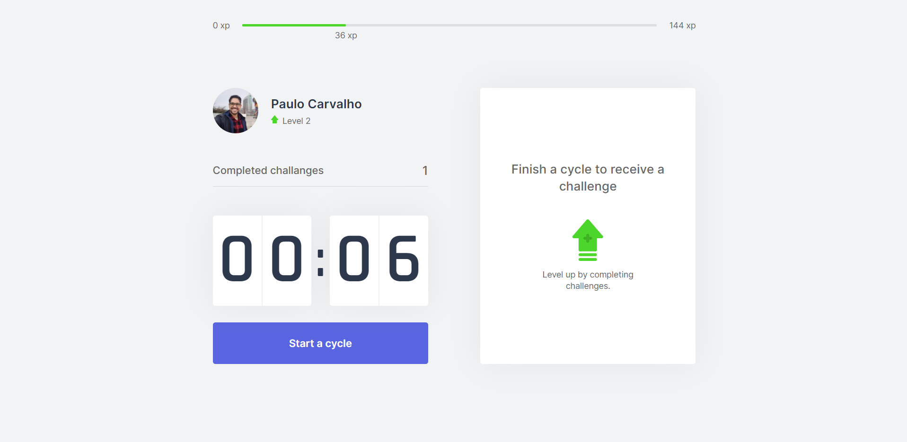
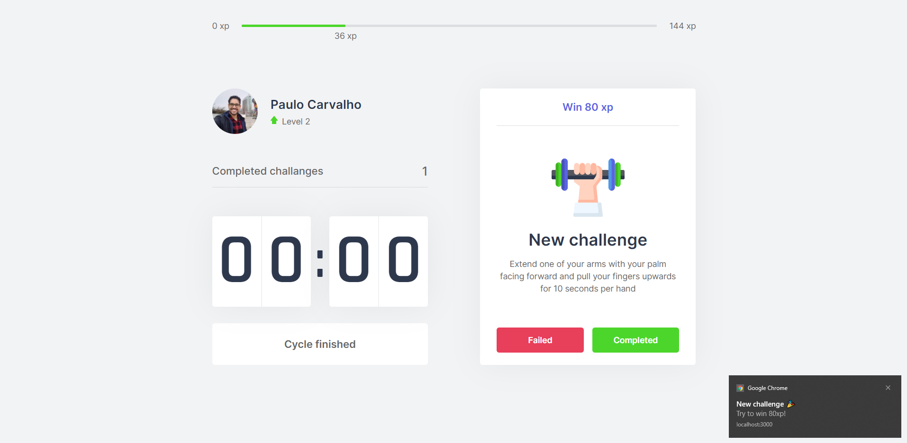

<div align="center">

<p align="center">
  
<p>

<p align="center">
  
  
</p>

**Move-it** is a project to help people to make more exercises.


The idea of this mini project is just to boost my abilities with React.js, Typescript, and NextJS.

<p align="center">
  
  
  
<p>

</div>

## Features

- The main ideia is to help you to get up of chair and make some exercises every 25 minutes.
- Everytime you do an exercise, you won some EXP to level up.
- Notifications on the Browser.
- Pomodoro timer.

## Summary

- [Technology](#rocket-technology)
  - [Application](#computer-web)
- [How to run](#boom-how-to-run)
  - [Web](#computer-web)


## :rocket: Technology

<div align="center">


</div>


## :computer: Application

The application was developed with:

- [Typescript](https://www.typescriptlang.org/)
- [ReactJS](https://reactjs.org/)
- [Next-Js](https://nextjs.org/)
- [JavaScript Cookie](https://github.com/js-cookie/js-cookie)


---

# :boom: How to run

- ### **Prerequisites**

  - It's **necessary** to have **[Node.js](https://nodejs.org/en/)** installed on the computer
  - It's **necessary** to have **[Git](https://git-scm.com/)** installed and configured on the computer
  - Also, it's **necessary** to have a package manager either **[NPM](https://www.npmjs.com/)** or **[Yarn](https://yarnpkg.com/)**.

Clone the repository:

```sh
  $ git clone https://github.com/paulo-carvalho93/move-it.git
```

## :computer: Web

```sh
  # API
  $ cd move-it
  
  # Installing project dependencies.
  $ yarn # or npm install

  # Start Web Project
  $ yarn dev # or npm dev

```

Go to http://localhost:3000/ to see the result.


FYI: If you want to reduce the time to just some seconds, you can change the value of the state at CountdownContext. 

```sh
  # LINE 24 - FROM
  $ const [time, setTime] = useState(25 * 60);
  
  # LINE 24 - TO
  $ const [time, setTime] = useState(0.1 * 60);

  # LINE 39 - FROM
  $ setTime(25 * 60);
  
  # LINE 39 - TO
  $ setTime(0.1 * 60);
```